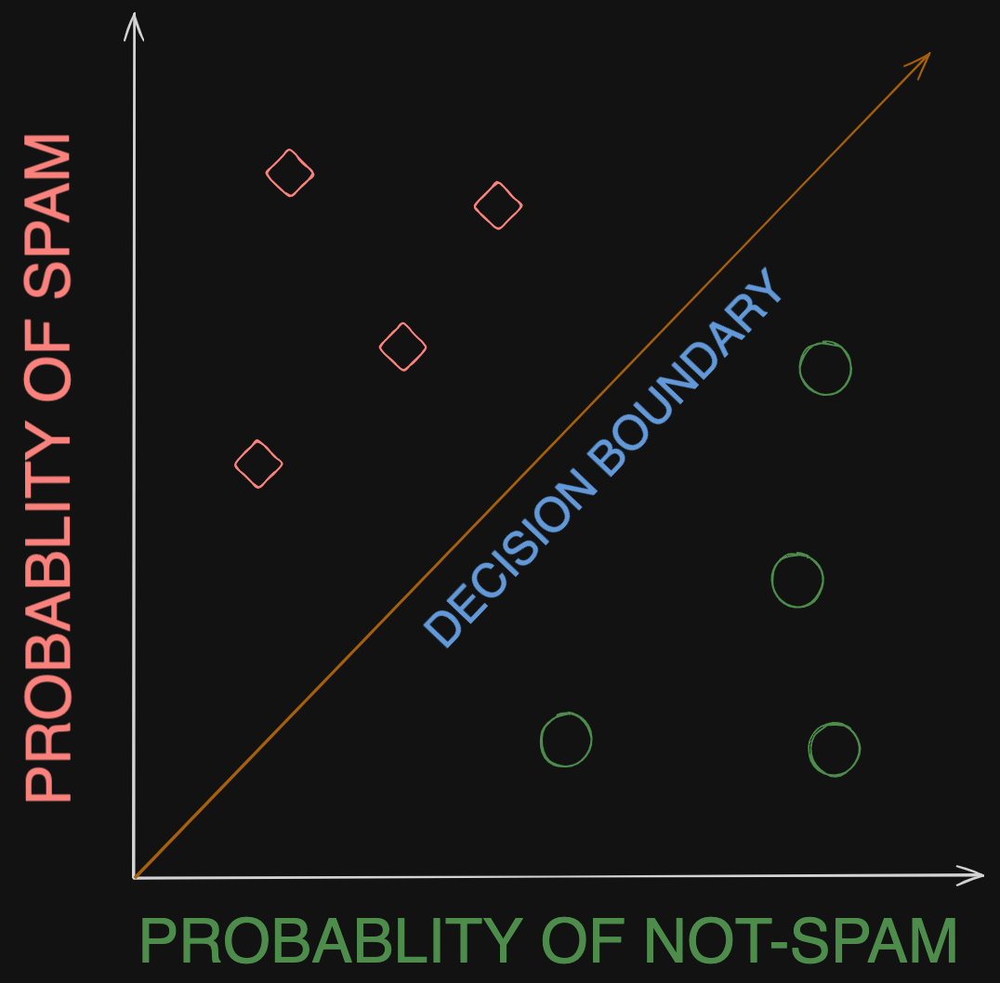
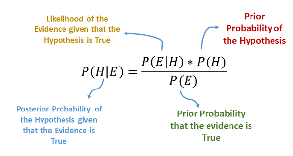

# Spam-Filter-Classifier

**Task** : Our team receives too much email spam. We only want to legitimate emails in our inbox. All incoming spam should be filtered out.


We will take the raw emails and pre-process the text data. Then train a machine learning model that classifies (Naive Bayes Classifer) the email as either spam or not-spam. Finally test the model's performance.


[Spam Email Data Source](https://spamassassin.apache.org/)

**Corpus**: A large and structured set of text.

**Document** : Refers particular item in corpus.


## Dataset

  - spam: 500 spam messages, all received from non-spam-trap sources.

  - easy_ham: 2500 non-spam messages.  These are typically quite easy to
    differentiate from spam, since they frequently do not contain any spammish
    signatures (like HTML etc).

  - hard_ham: 250 non-spam messages which are closer in many respects to
    typical spam: use of HTML, unusual HTML markup, coloured text,
    "spammish-sounding" phrases etc.

  - easy_ham_2: 1400 non-spam messages.  A more recent addition to the set.

  - spam_2: 1397 spam messages.  Again, more recent.

Total count: 6047 messages, with about a 31% spam ratio.

## Naive Bayes Algorithm

Naive Bayes compares two probabilities. If the probability of an email being spam is higher, then the email classified as spam. 



### Basic Probablity

$P(\text{Spam}) = \frac{\text{Nr. Spam Emails}}{\text{Total Nr. Emails}}$

### Joint Probabilty

$P(\text{Heads n Heads}) ={\text{P(Heads)}} \times{\text{P(Heads)}}$

Thats how we get probability of getting heads two times in a row. Independent.

### Conditional Probability 

E-mail contains the word "Viagra" what's the probability of this e-mail being spam? Dependent.

$P(\text{Spam | Viagra}) = \frac{\text{P(Spam n Viagra)}}{\text{P(Viagra)}}$

### Bayes Theorem

Bayes theroem makes our calculation more easier.

$P(\text{Spam} | \text{Viagra}) = \frac{P(\text{Viagra} | \text{Spam}) \cdot P(\text{Spam})}{P(\text{Viagra})}$

$ P(\text{Viagra} | \text{Spam}) = \frac{\text{Nr. Viagra in Spam Emails}}{\text{Nr. Total Words in Spam Emails}} $



We need conditional probability en each words in email. When email contains both "Viagra" and "Free". At this point we will use joint probability because two events are independent. The reason our algorithm is naive is because it assumes independence between the words in the email. 

We can calculate the probability of email being spam with using each word. Then we can compare this number of probability that is email is a normal email. Then we can do our comparison. This is called the **Bag of Words** approach for classfiyng the documents.
Each word becomes a feature for us. 

## Requirements

Requirements:
- pyenv with Python: 3.11.3


```Bash
pyenv local 3.11.3
python -m venv .venv
source .venv/bin/activate
pip install --upgrade pip
pip install -r requirements.txt
```